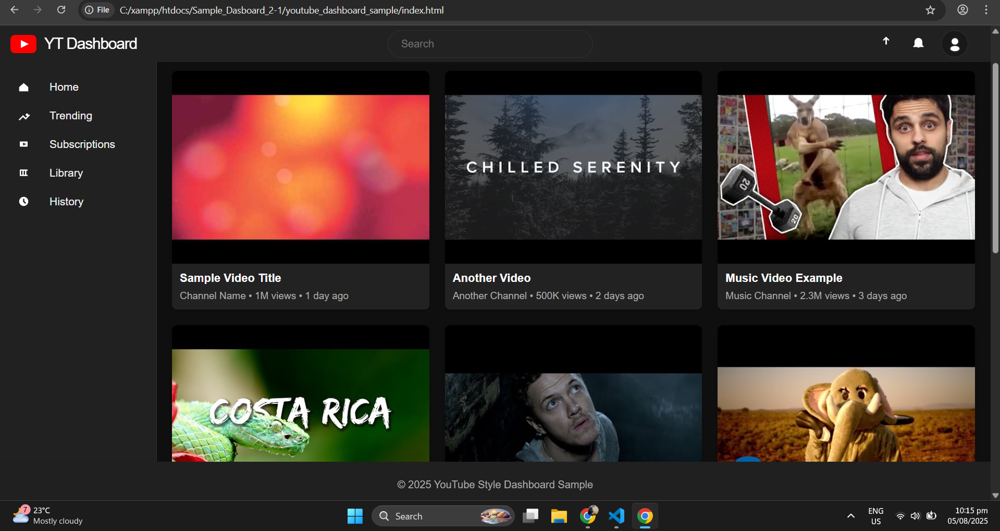
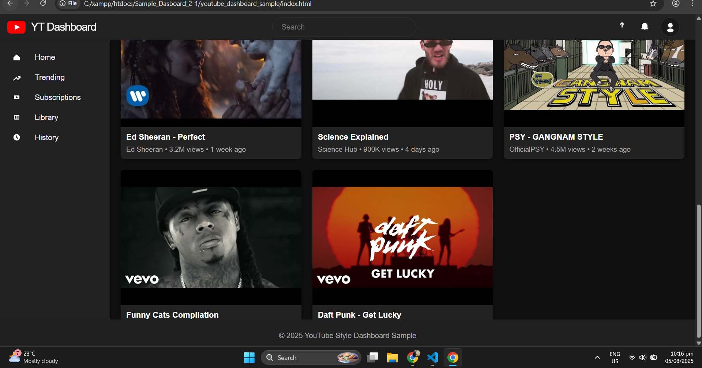
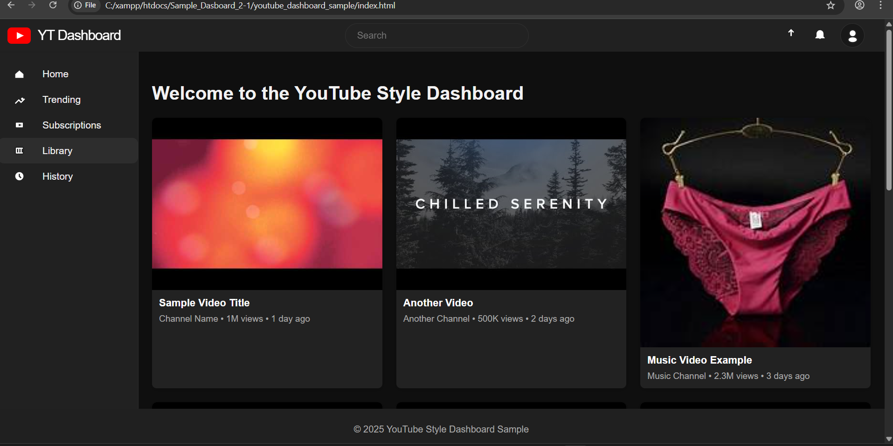

# Sample_Dasboard_2

A YouTube-style dashboard sample built with HTML, CSS, and JavaScript.

## Features
- Responsive layout inspired by YouTube
- Header with logo, search bar, and user actions
- Sidebar navigation
- Video grid with sample video cards
- Modern dark theme

## Usage
1. Open the `youtube_dashboard_sample/index.html` file in your browser.
2. Explore the dashboard UI and layout.

---

## 📸 Screenshot

---

---

---